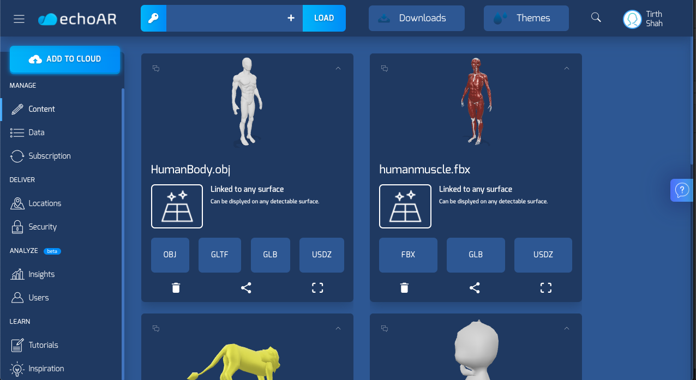
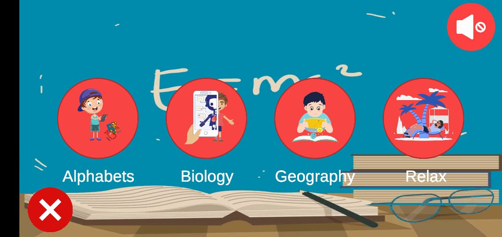
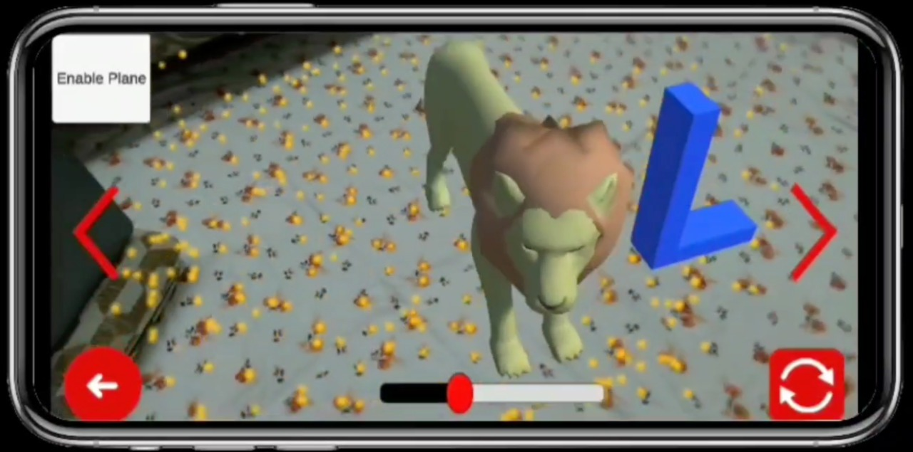
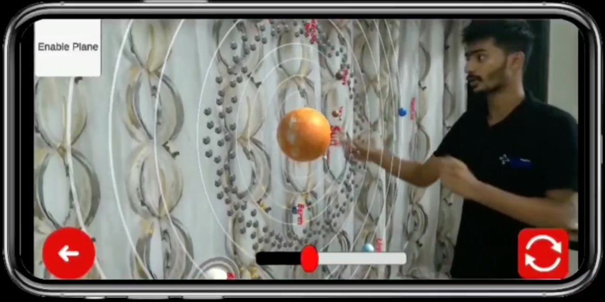
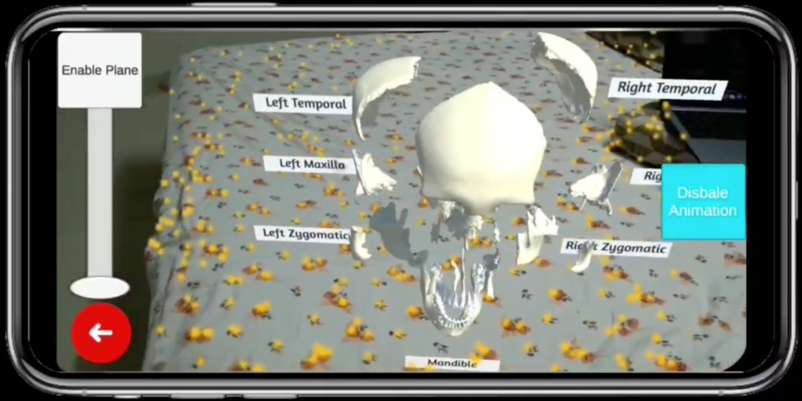
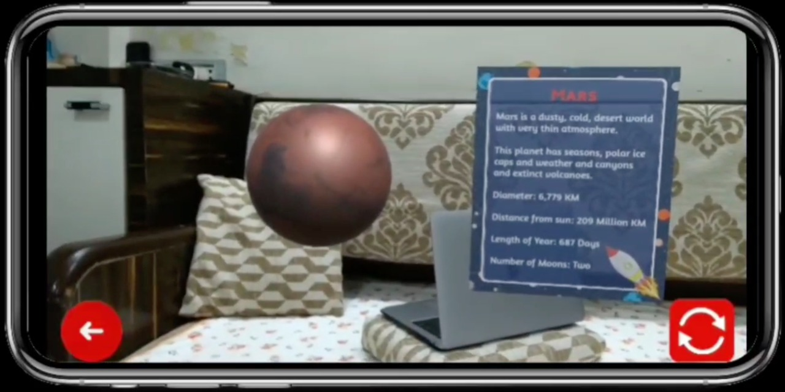
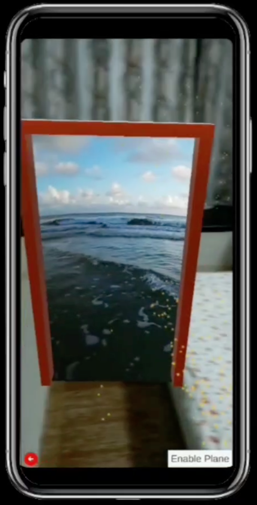

<!-- PROJECT LOGO -->
<br />
<p align="center">
    

  <h3 align="center">EduAR</h3>

  <p align="center">
    Experience the fun in learning
    <br />
    <a href="https://youtu.be/cCC-ZeLkoCA">Link to Demo</a><br />
  </p>
</p>


<!-- TABLE OF CONTENTS -->
## Table of Contents

* [About the Project](#about-the-project)
  * [Built With](#built-with)
* [Getting Started](#getting-started)
  * [Prerequisites](#prerequisites)
  * [Installation](#installation)


<!-- ABOUT THE PROJECT -->
## About The Project

Augmented Reality or AR  is a term for portraying virtual 3D objects in  real-world environment. Learning using Augmented Reality enhances the view and experience of learning. This can be implemented for students of all ages from kindergarten to high school. AR adds objects, graphics, sounds and pictures to enhance the learning environment and lets a student be completely involved in the learning process.

Students can move around and see the virtual object or animation from different views and also give game based quizzes to have a complete understanding of the topic.

Teachers will be able to use the features of Augmented Reality to facilitate the process of teaching which will help the student pay more attention and have better understanding.

Children and students can explore different places from their room itself to relax and take their mind off through an Augmented Portal.

<p align="center">
<b>Echo AR Dashboard</>
</p>
<p align="center">

</p>
<p align="center">
<b>Home Screen</>
</p>
<p align="center">

</p>
<p align="center">
<b>Viewing the object respective to the letter selected</>
</p>
<p align="center">
    
</p>
<p align="center">
<b>Interactive Teaching using EduAR</>
</p>
<p align="center">
    
</p>
<p align="center">
<b>Learning about parts of skull through self-learning</>
</p>
<p align="center">
    
</p>
<p align="center">
<b>Learn about planets in geography</>
</p>
<p align="center">
    
</p>
<p align="center">
<b>Relax your mind with the AR Portal</>
</p>
<p align="center">
    
</p>


### Built With

* [Unity](https://unity.com)
* ARFoundation
* C#
* Objective C
* [Blender](https://www.blender.org)
* [EchoAR](https://www.echoar.xyz)

<!-- GETTING STARTED -->
## Getting Started

### Prerequisites

* Unity
```sh
Download the Unity version 2020.1.3f1 from (https://unity3d.com/get-unity/download)
```
* Visual Studio
```sh
Download Microsoft Visual Studio (https://visualstudio.microsoft.com)
```

### Installation

#### Build and install using Unity 
1. Clone the repo
```sh
   https://github.com/vig2306/TOHacks-EduAR.git
```
2. Open Unity Hub
3. Click on Add Project
4. Project would be open in the Unity Editor

##### Test and Build

1. Test the application on your phone by choosing the platform (iOS or Android) from the build settings.
2. Switch to that platform and build the application.
3. If building for iOS, follow the further steps by using Xcode to build (MacOS Required)
4. If building for Android, an APK file will be created. Transfer it to your phone and test the application.

#### Install Directly on Android Device:

1. Download the APK file: 
        https://drive.google.com/file/d/1GebplM3PbUfoyXRFFxQc2HTL0s0nHX3p/view?usp=sharing
2. Install the app on your mobile phone.


